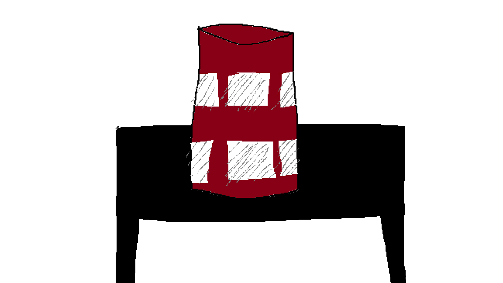
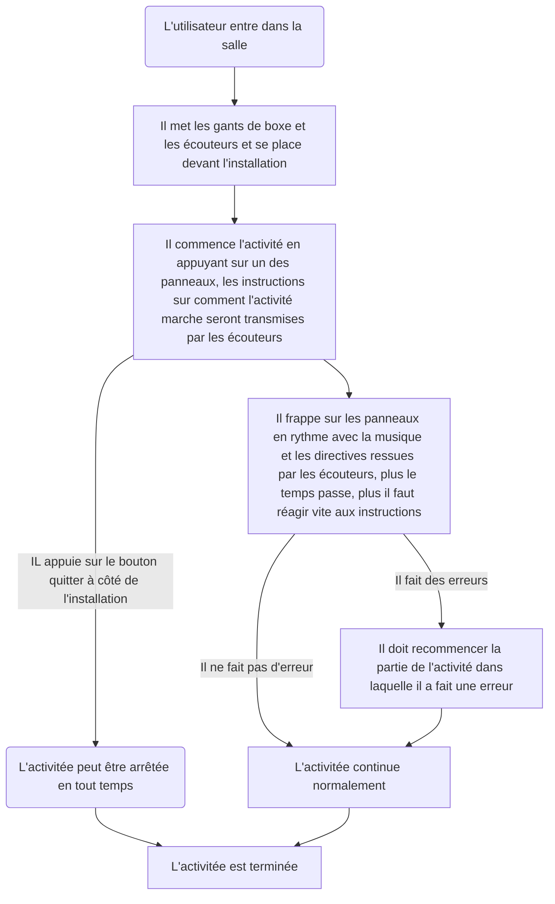
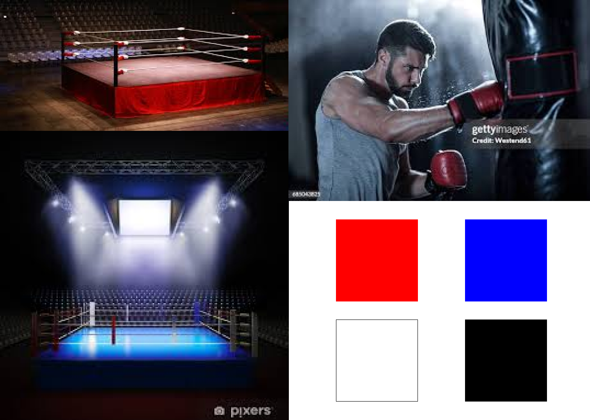

# Sac de sable

### *Par Samuel Desmeules-Voyer*

*[URL du Document](https://samesthumain.github.io/#/)*

## Concept
Je veux que l'utilisateur s'immerse dans le rôle d'un boxeur qui s'entraine pour son premier vrai match.

### Objectif
L'objectif de l'oeuvre est de promouvoir le sport, l'esprit sportif, l'esprit de compétition.
Mon but est de faire bouger les gens.

## Scénario

## Ambiance
### Visuelle

### Sonore

[Exemple de musique](https://www.youtube.com/watch?v=KPhqU--Mq1A)
[Exemple de Voix](https://www.youtube.com/watch?v=q-7bo1i_ZbA)

## Technologies

### Support
**Audio:**
- Écouteurs bluetooth  

**Lumière:**
- Lumières de scène
- LEDs bleus, blancs et rouges

### Matériel
**Intéractif:**
- M5Stack Atom
- Boutons  
 

**Autre:**
- Panneux et cylindre (imprimés en 3d)
- Table
- Peinture
- Gants de boxe
- Vis et visseuse pour fixer le "sac de sable" à la table
- Des ressorts pour le fonctionnement des panneaux

### Logiciel
- Arduino
- Reaper
- Max

*documentation par Samuel Desmeules-Voyer*
