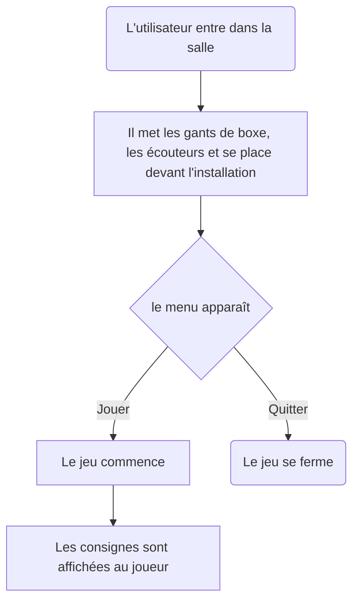

# Sac de sable

### *Par Samuel Desmeules-Voyer*

*[URL du Document](https://samesthumain.github.io/#/)*

## Concept
Je veux que l'utilisateur s'immerse dans le rôle d'un boxeur qui s'entraine pour son premier vrai match.

### Objectif
L'objectif de l'oeuvre est de promouvoir le sport, l'esprit sportif, l'esprit de compétition.
Mon but est de faire bouger les gens.

### Motivations

## Scénario

## Ambiance

## Technologies

audio
lumière
### Support

### Matériel

### Logiciel
Arduino

*documentation par Samuel Desmeules-Voyer*
