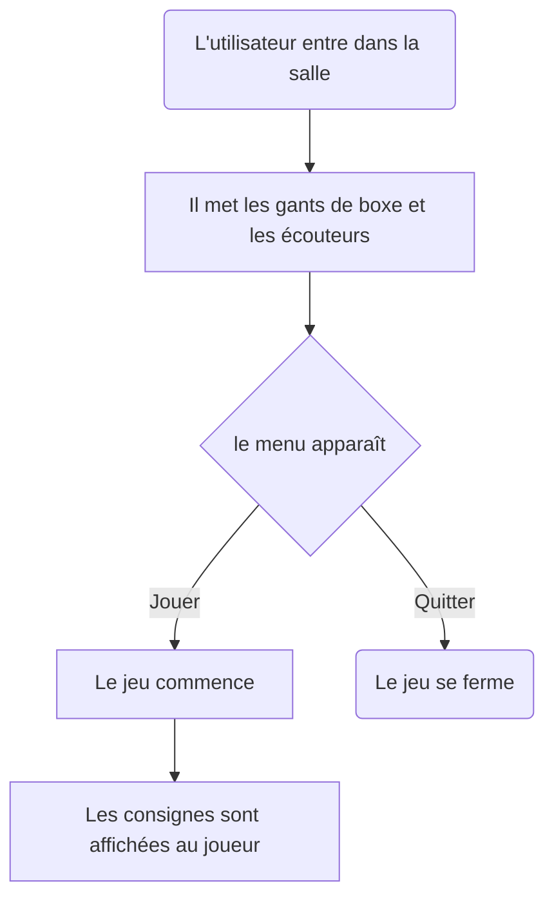

# Sac de sable

### *Par Samuel Desmeules-Voyer*

*[URL du Document](samesthumain.github.io/)*

## Concept
[concept ici]

### Objectif
[objectif]

### Motivations
[motivations créatives derrière le choix des médias et des technologies]

## Scénario

## Ambiance

## Technologies

### Support

### Matériel

### Logiciel

*documentation par Samuel Desmeules-Voyer*
