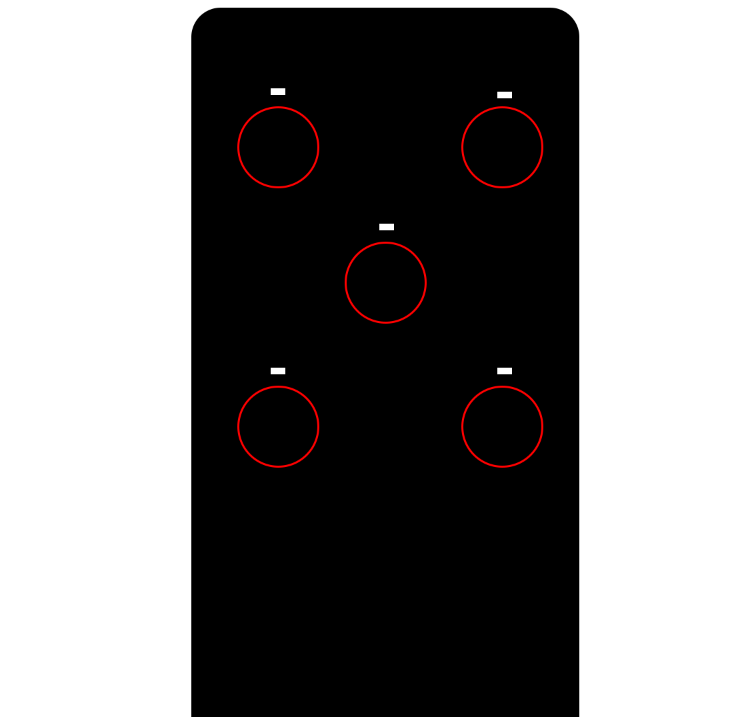
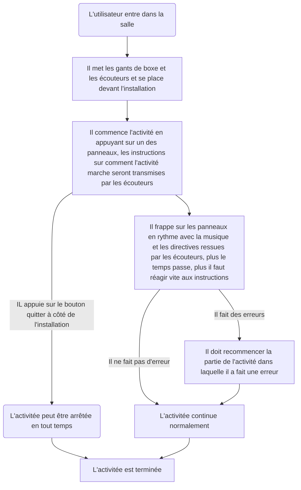
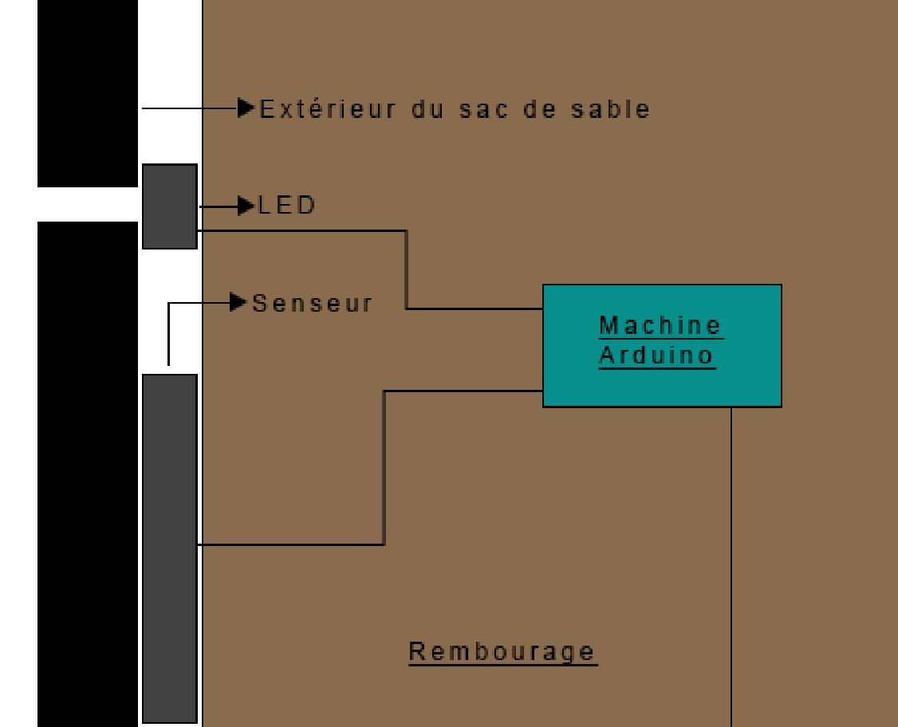

# Sac de sable

### *Par Samuel Desmeules-Voyer*

*[URL du Document](https://samesthumain.github.io/#/)*

## Concept
Je veux que l'utilisateur s'immerse dans le rôle d'un boxeur qui s'entraine pour son premier vrai match.

### Objectif
L'objectif de l'oeuvre est de promouvoir le sport, l'esprit sportif, l'esprit de compétition.
Mon but est de faire bouger les gens.

## Scénario

## Ambiance
### Visuelle

### Sonore

[Exemple de musique](https://www.youtube.com/watch?v=KPhqU--Mq1A)
[Exemple de Voix](https://www.youtube.com/watch?v=q-7bo1i_ZbA)

## Technologies

### branchement

### Support
**Audio:**
- Écouteurs bluetooth  

**Lumière:**
- 2 Lumières de scène (Spotlight)
- LEDs bleus, blancs et rouges

### Matériel
**Intéractif:**
- [7 Machines Arduino](https://www.amazon.ca/-/fr/A000066-Arduino-UNO-R3/dp/B008GRTSV6)
- [5 Senseurs de force](https://www.adafruit.com/product/5475)
- [5 LED uniques](https://www.amazon.ca/BTF-LIGHTING-WS2812B-Heatsink-10mm3mm-WS2811/dp/B01DC0J3UM/ref=sr_1_27?dib=eyJ2IjoiMSJ9.kbTPaU10VmF1KRMxCLmdtV1YKL_ZIUimvo1Kqp9Z1Z9uaoLQ4xhkrYQiCMGVOtkYkBlOAdhTyjzb99ebnF7LOyLYuXHQ3pRgkg5Zws8bY8_aArfZAjDeMqcWeOx1umTQY3lDYRngK1eC1i5pGZfSfgt_dmqYHoOISeAct4t14SWM_nLbhh3jLc9OIYF97qsH9vyu6rwBskMdpGU70X6Jn249yO5WQJy4TkqXw5V__GrCdsRXP1PabPH_XrZ3jhcHAt-zgmRmYClqqpNhXp3eFF51eUiHZ9quTCaSSd8vdVU.NJkf8A4XVxBsiOVo4GMREga0BO2PsdYXwfniul7UWNA&dib_tag=se&hvadid=604663782224&hvdev=c&hvlocphy=9000459&hvnetw=g&hvqmt=e&hvrand=6157044485708428037&hvtargid=kwd-296789589970&hydadcr=24949_13591938&keywords=led+for+arduino&qid=1730662687&sr=8-27)

**Autre:**
- [Gants de boxe et sac de sable.](https://www.amazon.ca/AILIXI-Punching-Unfilled-Kickboxing-Taekwondo/dp/B0BR6K49KH/ref=sr_1_3_sspa?dib=eyJ2IjoiMSJ9.pgRCYLaZT0AcMbh7P1UxqK4erqWFEOJ1OlAhQJB74t_pxtB4hl4iWgRpYFIdYZcR39pzb4YwLsbCMnfZGhHz-aiYI4UEoUcCk6bRuLpDS6e4lXz-Hr5fMGSRGrNnelHknAfRFl-M638f6eBSamEuzfDtk6DR4k8BA0ctGOr4J9lmS7jexpJz_1KC3IhjAyzus9RjHhFvoLZ27zSU4nFMt4XEbc22svTHOneGPykXF1Fl-dEsk0qYljgTyILiHPkPJ8UVY0M26cgHMzqF46iuSWQLMsbuOqABJZ8qB7UNS7c.gvwrEfDvOzRuSso47xBG7QDPCHQu1TAnw51mJiMBly4&dib_tag=se&keywords=punching+bag&qid=1730660492&sr=8-3-spons&sp_csd=d2lkZ2V0TmFtZT1zcF9hdGY&psc=1)
- Chaîne de métal pour fixer le sac.
- Peinture.
- Des poids pour forcer le sac de sable à rester droit.

### Logiciel
- Arduino
- Reaper
- Max

### Devis technique

**Fournis par l'artiste**
- 7 Machines Arduino
- 5 Senseurs de force
- 5 LEDs uniques
- 6 mètres de LEDs
- 1 sac de sable
- 1 paire de gants de boxe
- 1 paire d'écouteurs bluetooth
- branchement du matériel Arduino

**Fournis par l'organisateur**
- 2 Lumières de scène (Spotlight)
- 1 ordinateur
- Des Poids du grand studio

*documentation par Samuel Desmeules-Voyer*
