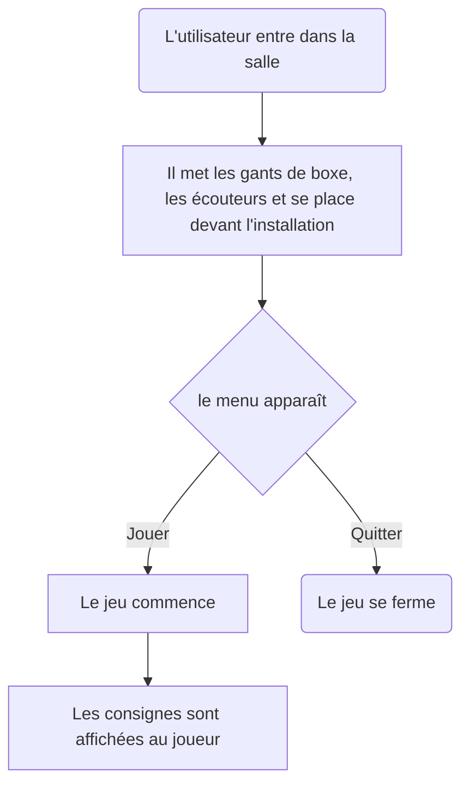

# Sac de sable

### *Par Samuel Desmeules-Voyer*

*[URL du Document](https://samesthumain.github.io/#/)*

## Concept
Je veux que l'utilisateur s'immerse dans le rôle d'un boxeur qui s'entraine pour son premier vrai match.

### Objectif
L'objectif de l'oeuvre est de promouvoir le sport, l'esprit sportif, l'esprit de compétition.
Mon but est de faire bouger les gens.

## Scénario

## Ambiance
### Visuelle

### Sonore

[Exemple de musique](https://www.youtube.com/watch?v=KPhqU--Mq1A)
[Exemple de Voix](https://www.youtube.com/watch?v=q-7bo1i_ZbA)

## Technologies

### Support
Audio: Écouteurs bluetooth  
Lumière: 
- Lumières de scène
- LEDs

### Matériel
**Intéractif:**
- M5Stack Atom
- Boutons

**Autre:**
- Panneux et cylindre en plastique (imprimés en 3d)

### Logiciel
Arduino

*documentation par Samuel Desmeules-Voyer*
